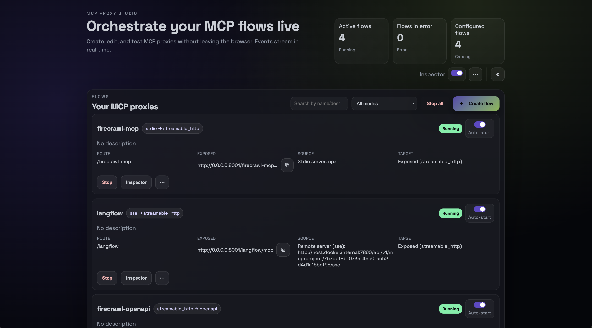
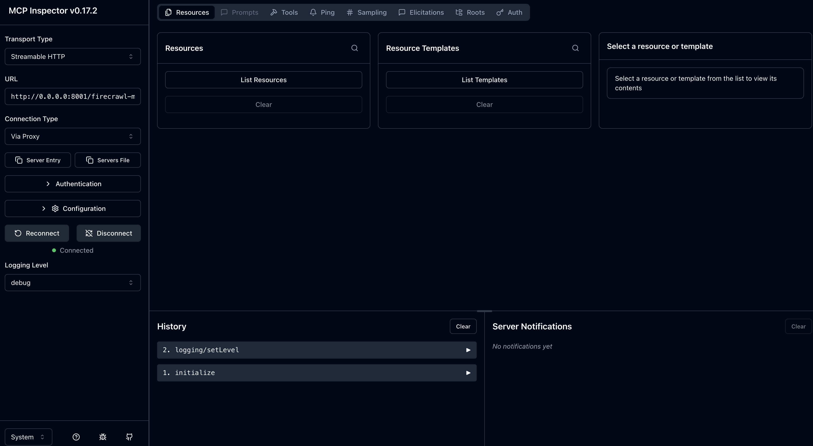

<p align="center">
  
</p>

<h1 align="center">MCP Proxy Studio</h1>

<p align="center">
  <strong>A visual dashboard to create, run and monitor MCP proxies — stdio, SSE, streamable HTTP & OpenAPI.</strong><br>
  Zero CLI friction. Live logs. Integrated Inspector. Auto-start flows.
</p>

<p align="center">
  
</p>

---

## 🎥 Demo (Screenshots)

- **Dashboard overview**  
  

- **Flow editor**  
  

- **Live events & Inspector integration**
  
  

---

## 🚀 Features

- **Visual Flow Builder** – Manage your stdio, SSE, streamable HTTP & OpenAPI flows.
- **Integrated MCP Inspector** – Per-flow or global launch, auto-configured.
- **Live event feed** – Real-time logs with optional persistence.
- **OpenAPI Bridge** – Auto-spawns `@ivotoby/openapi-mcp-server` when required.
- **Auto-start system** – Flows & Inspector can boot automatically with safe state handling.
- **Clean UI, no framework** – All vanilla JS with SSE realtime feedback.

---

## 📦 Quick Start

### One-liner to start (npx)
```bash
npx -y github:lucasiscovici/MCP-Proxy-Studio start
```

### One-liner to start (uvx)
```bash
uvx --from git+https://github.com/lucasiscovici/MCP-Proxy-Studio@main mcps start
```

### One-liner to start (docker-compose)
```bash
curl -fsSL https://raw.githubusercontent.com/lucasiscovici/MCP-Proxy-Studio/main/docker-compose.yml | docker compose up -d
```

### One-liner to stop (npx)
```bash
npx -y github:lucasiscovici/MCP-Proxy-Studio stop
```

### One-liner to stop (uvx)
```bash
uvx --from git+https://github.com/lucasiscovici/MCP-Proxy-Studio@main mcps stop
```

### One-liner to stop (docker-compose)
```bash
curl -fsSL https://raw.githubusercontent.com/lucasiscovici/MCP-Proxy-Studio/main/docker-compose.yml | docker compose down
```

### Others (npx)
```bash
# Optional:
# npx -y github:lucasiscovici/MCP-Proxy-Studio status
# npx -y github:lucasiscovici/MCP-Proxy-Studio update

# Force replace container
npx -y github:lucasiscovici/MCP-Proxy-Studio start --force
npx -y github:lucasiscovici/MCP-Proxy-Studio update -- force
```

### Others (uvx)
```bash
# Optional:
# uvx --from git+https://github.com/lucasiscovici/MCP-Proxy-Studio@main mcps status
# uvx --from git+https://github.com/lucasiscovici/MCP-Proxy-Studio@main mcps update

# Force replace container
uvx --from git+https://github.com/lucasiscovici/MCP-Proxy-Studio@main mcps start --force
uvx --from git+https://github.com/lucasiscovici/MCP-Proxy-Studio@main mcps update -- force
```

### Others (docker-compose)
```bash
# Optional:
# curl -fsSL https://raw.githubusercontent.com/lucasiscovici/MCP-Proxy-Studio/main/docker-compose.yml | docker compose ps
# curl -fsSL https://raw.githubusercontent.com/lucasiscovici/MCP-Proxy-Studio/main/docker-compose.yml | docker compose up -d --build
```

Open: **[http://localhost:8000](http://localhost:8000)**
Your config is stored in `mcp-dashboard-data` volume.

---

## 🔧 Ports

| Component             | Port                          |
| --------------------- | ----------------------------- |
| Dashboard UI          | **8000**                      |
| Streamable HTTP       | **8001**                      |
| SSE events            | **8002**                      |
| OpenAPI target (mcpo) | **8003** (`/<route>`) |
| MCP Inspector UI      | **6274** (server: 6277)       |

---

## 🧩 Flow Model

### Sources

* **stdio** – command/args/env
* **sse** – URL + headers
* **streamable_http** – URL + headers
* **openapi** – base URL + spec → spawns automatic helper

### Targets

* `sse`
* `streamable_http`
* `openapi`

> OpenAPI sources always target `streamable_http`.

### Resulting Endpoints

* Streamable target → `http://<host>:8001/<route>/mcp`
* SSE target → `http://<host>:8002/<route>/sse`
* OpenAPI target → `http://<host>:8003/<route>`

---

## 🖥 Using the UI

1. **Create** a flow
2. **Start/Stop** (per-flow or global)
3. **Inspect** – Opens MCP Inspector already configured
4. **Monitor** – Live event stream with optional persistence
5. **Configure** – Auto-start behaviors and settings

---

## 📚 OpenAPI Management

For OpenAPI sources:

* Runs automatically:
  `npx -y @ivotoby/openapi-mcp-server`
* Waits for readiness
* Exposes targets via `mcpo` at **port 8003**
* Inspector opens automatically on `/docs`

---

## 🔌 Built On (Key Dependencies)

### Core MCP tooling

* [TBXark/mcp-proxy](https://github.com/TBXark/mcp-proxy)
* [mcpo](https://github.com/open-webui/mcpo)
* [@ivotoby/openapi-mcp-server](https://github.com/ivo-toby/mcp-openapi-server)
* [@modelcontextprotocol/inspector](https://github.com/modelcontextprotocol/inspector)

### Backend

* **FastAPI**, **Uvicorn**, **Pydantic**
* **asyncio**, **subprocess** orchestration

### Frontend

* **Vanilla JavaScript**
* **EventSource (SSE)**
* **Fetch API**

### Dev / Runtime

* **Docker / docker-compose**
* **npx**, **uvx**

---

## ⚙️ Environment Variables

| Variable                                           | Description                                       |
| -------------------------------------------------- | ------------------------------------------------- |
| `MCP_PROXY_BIN`                                    | default: `mcp-proxy`                              |
| `MCP_OPENAPI_BIN`                                  | default: `uvx mcpo`                               |
| `MCP_INSPECTOR_BIN`                                | default: `npx -y @modelcontextprotocol/inspector` |
| `MCP_INSPECTOR_PORT` / `MCP_INSPECTOR_SERVER_PORT` | Inspector ports                                   |

---

## 🛠 Dev Notes

* **Backend:** FastAPI orchestrates child processes and persists configs in `mcp-dashboard-data` volume
* **Frontend:** Vanilla JS with modals + SSE updates
* Auto-start guarded by container boot ID

---

## 🧑‍💻 Development

### Docker Compose Prod

```bash
git clone https://github.com/lucasiscovici/MCP-Proxy-Studio.git && cd MCP-Proxy-Studio
```

```bash
make dev
```

---

## 🚢 Production (versioned image)

```bash
make prod
```
---

## ❗ Troubleshooting

* **OpenAPI → 404**: check upstream MCP
* **Stdio issues**: ensure `npx`, `uvx`, or `docker` exist in PATH
* **Inspector unreachable**: check ports `6274/6277`

---

## ⭐ Star History

[](https://star-history.com/#lucasiscovici/MCP-Proxy-Studio&Date)

---

## License

MIT
